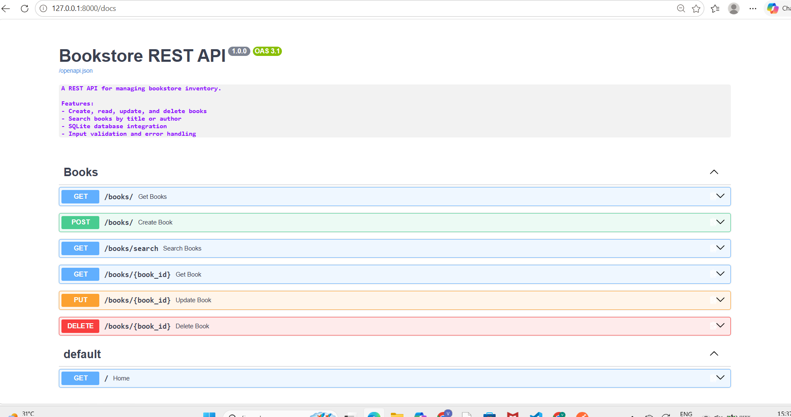
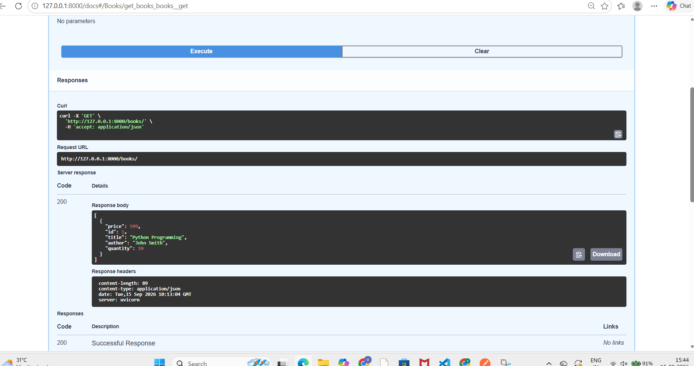
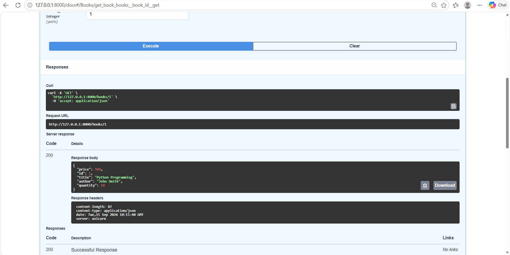
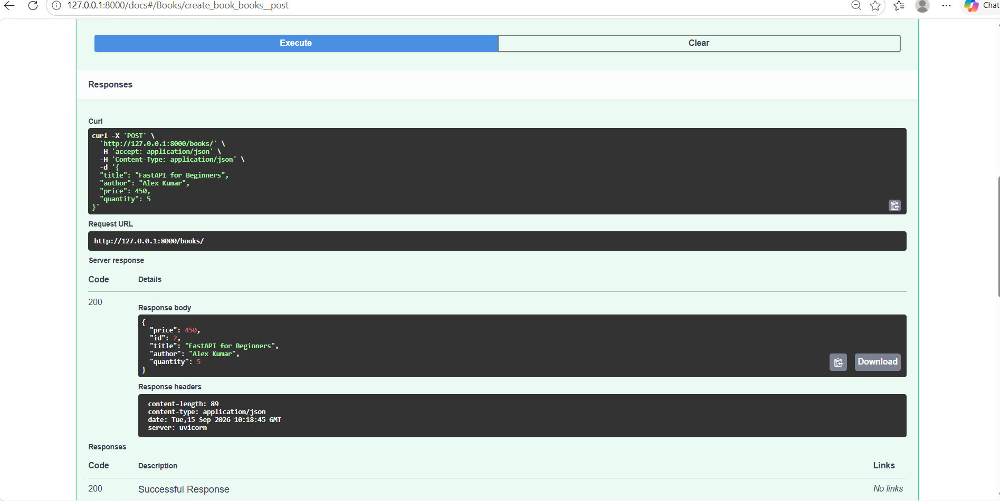
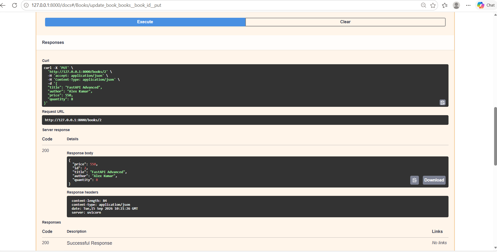
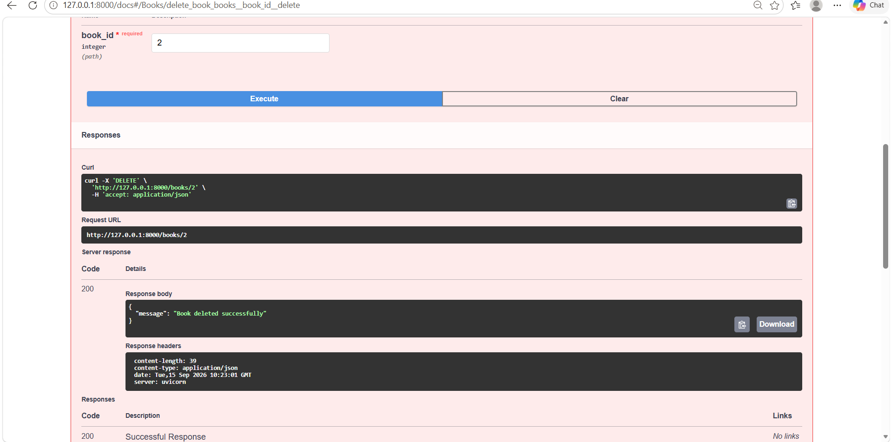
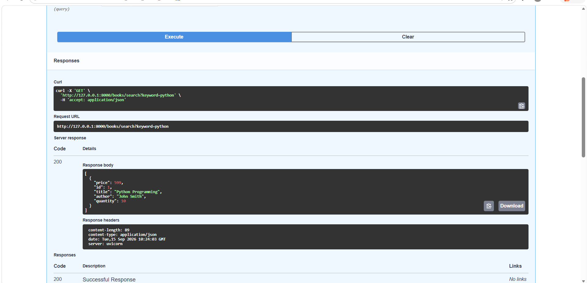

# Bookstore REST API

A REST API built with Python and FastAPI for managing bookstore inventory.

The application provides CRUD operations, book search functionality, input validation, error handling, SQLite database integration, Swagger API documentation, and Postman testing.

---

## 1. Project Overview

The Bookstore REST API is a backend application designed to manage books in a bookstore inventory.

The API allows users to:

- Add new books
- View all books
- View a specific book by ID
- Update existing book information
- Delete books
- Search books by title or author
- Validate input data
- Handle requests for books that do not exist
- Test API endpoints using Postman
- View and test API endpoints through Swagger UI

---

## 2. Project Objectives

The main objectives of this project are:

1. Build a RESTful API using FastAPI.
2. Implement CRUD operations for bookstore inventory.
3. Store book information using SQLite.
4. Connect the API to the database using SQLAlchemy.
5. Implement input validation using Pydantic.
6. Implement error handling for missing resources.
7. Implement book search by title or author.
8. Test API endpoints using Postman.
9. Provide interactive API documentation using Swagger UI.

---

## 3. Technologies Used

| Technology | Purpose |
|---|---|
| Python | Programming language |
| FastAPI | REST API framework |
| Uvicorn | ASGI server |
| SQLAlchemy | Database ORM |
| SQLite | Database |
| Pydantic | Data validation |
| Swagger UI | API documentation and testing |
| Postman | API testing |

---

## 4. Application Features

### Book Management

The API supports:

- Create Book
- Read All Books
- Read Book by ID
- Update Book
- Delete Book

### Search

Books can be searched using a keyword that matches:

- Book title
- Author name

### Validation

The API validates:

- Book title
- Author name
- Price
- Quantity

### Error Handling

The API returns a `404 Not Found` response when a requested book does not exist.

---

## 5. Database Structure

The project uses **SQLite** as the database and **SQLAlchemy** as the Object-Relational Mapping (ORM) tool.

### Books Table

| Column | Data Type | Description |
|---|---|---|
| id | Integer | Unique identifier for each book |
| title | String | Name of the book |
| author | String | Name of the author |
| price | Float | Price of the book |
| quantity | Integer | Available quantity |

### Primary Key

The `id` column is the primary key and uniquely identifies each book.

### Database File

The SQLite database file is:

```text
bookstore.db

| Method | Endpoint                       | Description       |
| ------ | ------------------------------ | ----------------- |
| GET    | `/books/`                      | Get all books     |
| POST   | `/books/`                      | Create a new book |
| GET    | `/books/search?keyword=python` | Search books      |
| GET    | `/books/{book_id}`             | Get a book by ID  |
| PUT    | `/books/{book_id}`             | Update a book     |
| DELETE | `/books/{book_id}`             | Delete a book     |

7. API Request Examples
7.1 Get All Books

GET

/books/

Returns all books available in the bookstore inventory.

Example response:

[
    {
        "price": 599.0,
        "id": 1,
        "title": "Python Programming",
        "author": "John Smith",
        "quantity": 10
    }
]
7.2 Create a Book

POST

/books/

Example request:

{
    "title": "FastAPI for Beginners",
    "author": "Alex Kumar",
    "price": 450,
    "quantity": 5
}

The API creates a new book and assigns a unique ID.

7.3 Get Book by ID

GET

/books/{book_id}

Example:

GET /books/1

Example response:

{
    "price": 599.0,
    "id": 1,
    "title": "Python Programming",
    "author": "John Smith",
    "quantity": 10
}
7.4 Update a Book

PUT

/books/{book_id}

Example:

PUT /books/1

Example request:

{
    "title": "Advanced Python Programming",
    "author": "John Smith",
    "price": 699,
    "quantity": 15
}

The API updates the existing book information.

7.5 Delete a Book

DELETE

/books/{book_id}

Example:

DELETE /books/2

Example response:

{
    "message": "Book deleted successfully"
}
7.6 Search Books

GET

/books/search?keyword=python

The search checks the keyword against the book title and author.

Example response:

[
    {
        "price": 599.0,
        "id": 1,
        "title": "Python Programming",
        "author": "John Smith",
        "quantity": 10
    }
]
8. Input Validation

The API uses Pydantic models to validate incoming data.

Validation rules include:

Title must contain at least one character.
Author must contain at least one character.
Price must be greater than zero.
Quantity must be zero or greater.

For example, the following data is invalid:

{
    "title": "",
    "author": "John Smith",
    "price": -100,
    "quantity": -5
}

FastAPI automatically returns a validation error response when invalid data is submitted.

9. Error Handling

The API handles requests for books that do not exist.

Example:

GET /books/999

Response:

{
    "detail": "Book not found"
}

HTTP status code:

404 Not Found

The same error handling is implemented for update and delete operations when the requested book ID does not exist.

10. Swagger API Documentation

FastAPI provides interactive API documentation using Swagger UI.

After starting the application, open:

http://127.0.0.1:8000/docs

Swagger provides an interface for:

Viewing available endpoints
Viewing request parameters
Testing GET requests
Testing POST requests
Testing PUT requests
Testing DELETE requests
Viewing request validation schemas
Viewing API responses
11. Postman Testing

The API was tested using Postman.

The following operations were tested successfully:

GET all books
GET book by ID
POST create book
PUT update book
DELETE book
Search books
404 error handling

A Postman collection named Bookstore REST API was created to organize the API requests.

The collection contains:

GET - Get All Books
GET - Get Book by ID
POST - Create Book
PUT - Update Book
DELETE - Delete Book
GET - Search Books

## 12. Screenshots

### Swagger API Documentation


### Get All Books


### Get Book by ID


### Create Book


### Update Book


### Delete Book


### Search Books


---
13. Project Structure

Bookstore-REST-API/
│
├── app/
│   ├── __init__.py
│   ├── main.py
│   ├── database.py
│   ├── models.py
│   ├── schemas.py
│   └── routes.py
│
├── screenshots/
│   ├── 01-swagger-api-documentation.png
│   ├── 02-get-all-books.png
│   ├── 03-get-book-by-id.png
│   ├── 04-create-book.png
│   ├── 05-update-book.png
│   ├── 06-delete-book.png
│   └── 07-search-books.png
│
├── bookstore.db
├── requirements.txt
└── README.md

```text
bookstore.db

14. File Description
main.py

Creates the FastAPI application, configures the API information, creates the database tables, and includes the API routes.

database.py

Configures the SQLite database connection using SQLAlchemy and provides database sessions.

models.py

Defines the SQLAlchemy database model for the books table.

schemas.py

Defines Pydantic schemas used for request validation.

routes.py

Contains the API endpoints for:

Creating books
Reading books
Updating books
Deleting books
Searching books
bookstore.db

SQLite database file used to store book inventory.

requirements.txt

Contains the Python packages required to run the project.

screenshots/

Contains screenshots documenting the API testing and Swagger documentation.

15. Running the Project
Step 1: Open the Project Directory
C:\Users\Vivek\Bookstore-REST-API
Step 2: Create a Virtual Environment
python -m venv venv
Step 3: Activate the Virtual Environment

For Windows PowerShell:

.\venv\Scripts\Activate.ps1
Step 4: Install Dependencies
pip install -r requirements.txt
Step 5: Start the FastAPI Server
uvicorn app.main:app --reload

The application will run at:

http://127.0.0.1:8000
Step 6: Open Swagger Documentation
http://127.0.0.1:8000/docs
16. Testing Results

The following API operations were successfully tested:

Test	Result
Get all books	Passed
Get book by ID	Passed
Create book	Passed
Update book	Passed
Delete book	Passed
Search books	Passed
Missing book ID	Passed
Input validation	Implemented
Swagger documentation	Available
Postman testing	Completed
17. Sample Database Record

The current test database contains a sample book:

{
    "id": 1,
    "title": "Python Programming",
    "author": "John Smith",
    "price": 599.0,
    "quantity": 10
}
18. REST API Concepts Demonstrated

This project demonstrates practical understanding of:

REST API architecture
HTTP methods
GET requests
POST requests
PUT requests
DELETE requests
JSON data
CRUD operations
HTTP status codes
Query parameters
Path parameters
Request validation
Error handling
Database integration
SQLAlchemy ORM
SQLite
API testing with Postman
API documentation with Swagger
19. Learning Outcomes

Through this project, I gained practical experience in:

Developing REST APIs using FastAPI
Working with Python backend development
Designing a basic database schema
Using SQLAlchemy ORM
Working with SQLite
Implementing CRUD operations
Implementing search functionality
Validating API request data
Handling API errors
Testing APIs using Postman
Using Swagger UI for API documentation
Understanding HTTP methods and status codes
20. Future Improvements

The project can be extended with:

User authentication and authorization
JWT authentication
Book categories
ISBN numbers
Pagination
Advanced filtering and sorting
Stock management
Automated unit testing
Docker containerization
Cloud deployment
CI/CD pipeline

These features are future improvements and are not currently implemented.

21. Conclusion

The Bookstore REST API provides a functional backend system for managing bookstore inventory.

The project demonstrates practical implementation of RESTful API principles, CRUD operations, database integration, input validation, error handling, search functionality, API testing, and interactive documentation.

The project provided hands-on experience with Python, FastAPI, SQLAlchemy, SQLite, Pydantic, Uvicorn, Swagger UI, and Postman.

The application can be further extended with authentication, automated testing, Docker, cloud deployment, and CI/CD practices.

Author

Vivek C Raj

BCA | Backend / Cloud / DevOps Learning Project
